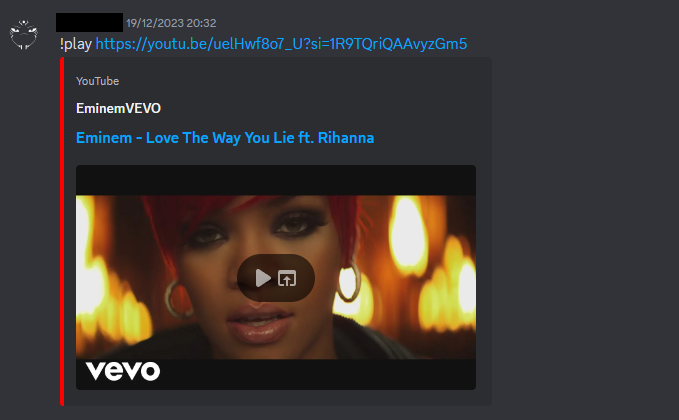
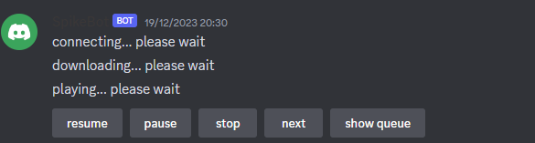
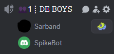

# Discord Spike Music Bot

this discord music bot can get u music from youtube videos online and play them through a voice call in discord in a server channel

all the code is written in python

demo:

1- request the song with !play [YoutubeVideoURL]

2- the bot will automatically download the audio of the song and play it in the server

## requirements

1- you need to make a bot in the discord developer portal and get the BOT token

2- you need python3 to be installed

3- you need to install the requiremtns.txt file with pip `pip install -r  .\requirements.txt`

*feel free to fork this repo and use it for personal use*

much love <3
